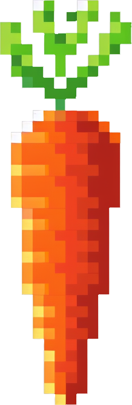

<div align="center">
  
</div>
<div align="center">

# KakaSwap

</div>
<div align="center">

[](LICENSE)


</div>

# ⚡ KakaSwap AMM

Kakaswap is a very basic AMM Frontend that allows users to swap tokens and provide liquidity to a UniV2 contracts implementation.
It has been developed as a public good to the Kakarot community by [AVNU team ❤️](https://www.avnu.fi/).

# 📋 Contracts

Deployed contracts on the kakarot testnet are pure Uniswap V2 implementation without any changes. You can find [here the source code of the core](https://github.com/Uniswap/v2-core) and [here the source code of the periphery](https://github.com/Uniswap/v2-periphery).

For more informations, you can check the [Uniswap documentation](https://docs.uniswap.org/).

## Deployments

### Kakarot sepolia testnet

- UniswapV2Factory: 0xe4CEb28E1e3a6192542A778f1c7277b7267C00B8
- UniswapV2Router02: 0x7c51B6E67a3a7deD9E61F555e1f9FFb9BdE7ae4d

Others protocols contracts already deployed on Kakarot can be found [here](https://docs.kakarot.org/survival-guide)

# 👷 Development

## Prerequisites

In order to be able to run the project, you need to have the followings:
- Font-awesome Pro license to use the icons in this project. You can get a free trial [here](https://fontawesome.com/plans).
- Wallet connect PROJECT_ID. You can get it [here](https://cloud.walletconnect.com).

## Installation

```bash
FONT_AWESOME_TOKEN=YOUR_KEY yarn
FONT_AWESOME_TOKEN=YOUR_KEY yarn dev # to start the development server (localhost:3000)
```

## Improvements

A lot of improvements can be done on this project. Here are some ideas:
- Enhanced management of errors and loading states
- Transactions history & details(**Everything is already stored on local storage, only UI needed**)
- Custom tokens importing (liquidity part already accept trustless pools deployments, but a bit more work in UX can be done when importing custom tokens)
- Add more tests (some are already implemented as example)
- Clean duplicate code & make it more readable
- Add more features like staking, farming, etc.
- SEO optimization
- Add more languages
- ...


# ⚠️ Warning: Unaudited Code

This repository contains code that has not been audited. This frontend have been built to support the launch of the Kakarot testnet, and in no way are we responsible for any bugs or issues that may arise.

**Use at Your Own Risk**: We strongly recommend that anyone intending to use this code conducts a thorough audit through professional services and carefully reviews all components.

**Disclaimer**: The code is provided "as is", without warranty of any kind, express or implied, including but not limited to the warranties of merchantability, fitness for a particular purpose, and noninfringement. In no event shall the authors or copyright holders be liable for any claim, damages, or other liability, whether in an action of contract, tort, or otherwise, arising from, out of, or in connection with the software or the use or other dealings in the software.

**Attribution**: If you use or modify this code, you must give appropriate credit, provide a link to the license, and indicate if changes were made. You may do so in any reasonable manner, but not in any way that suggests the licensor endorses you or your use.

---

For more details on licensing, see the [LICENSE](LICENSE) file.
